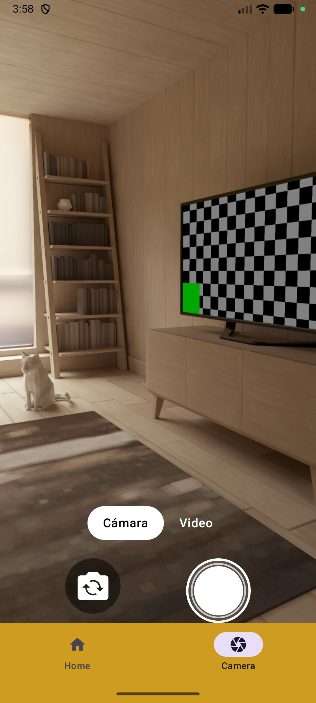
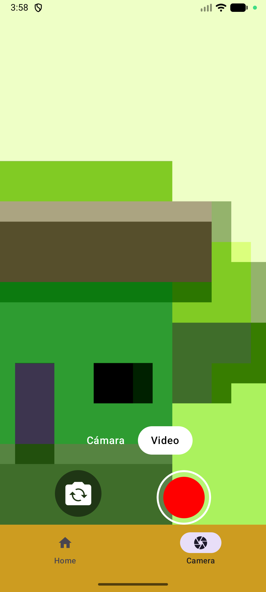
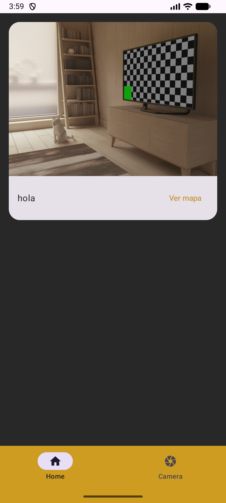
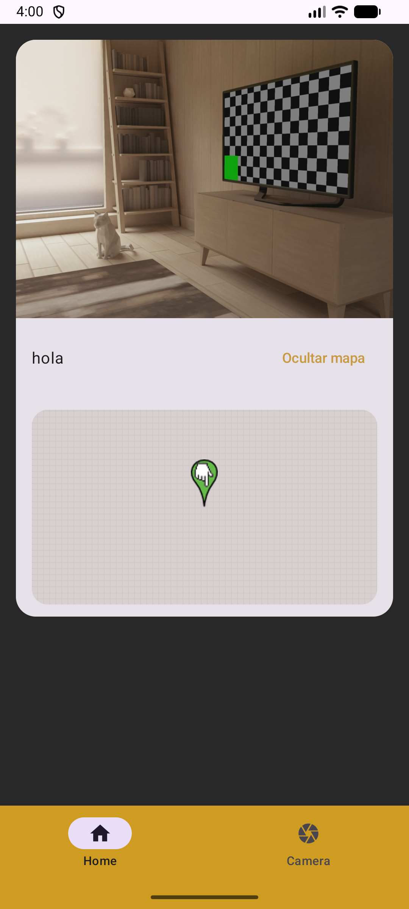
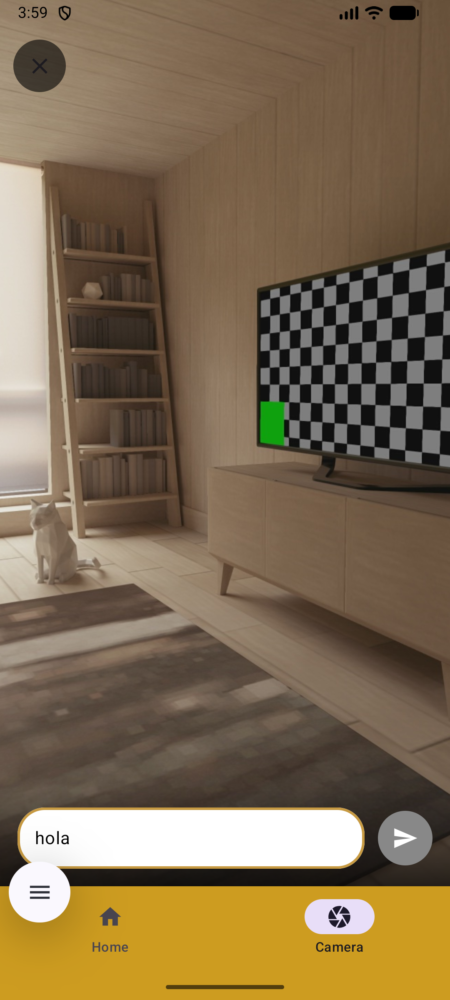
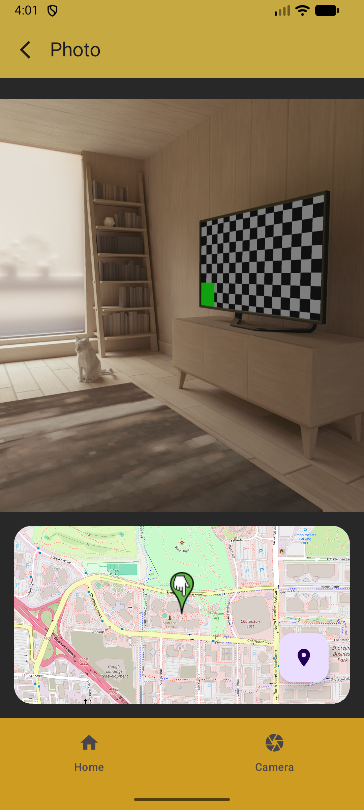
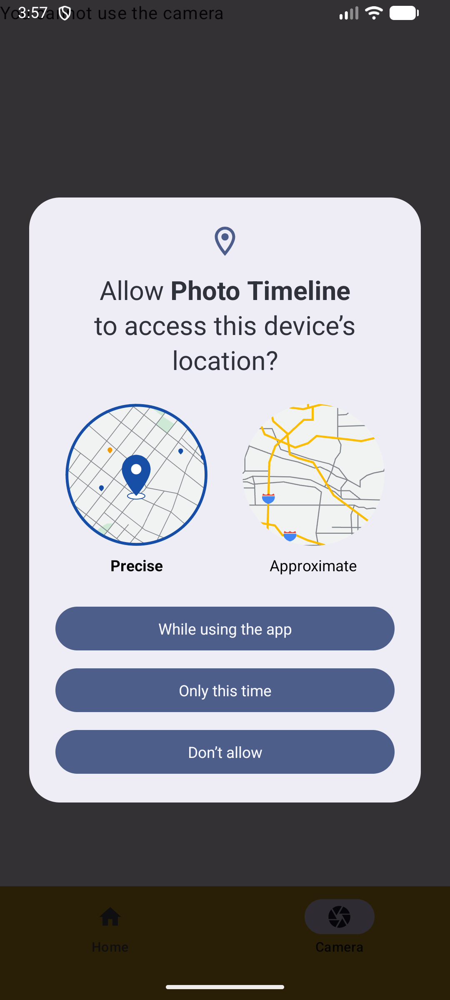

# 📸 Photo-Timeline-App

## 🧩 Descripción

**Photo-Timeline-App** es una aplicación Android desarrollada en **Android Studio** que permite capturar fotos y videos utilizando **CameraX**, con una interfaz moderna construida en **Jetpack Compose**.

La app organiza el contenido en una línea de tiempo visual y permite explorar cada captura con información adicional como ubicación y mensajes personalizados.

---

## 🚀 Características principales

* 📷 Captura de fotos usando CameraX
* 🎥 Grabación de videos
* 🔄 Cambio entre cámara frontal y trasera
* 📝 Añadir un mensaje personalizado antes de guardar
* 🖼️ Guardado automático en la galería del dispositivo
* 📋 Visualización de fotos en formato timeline
* 📍 Visualización de ubicación de cada foto

---

## 🛠️ Tecnologías utilizadas

* **Lenguaje:** Kotlin
* **UI:** Jetpack Compose
* **IDE:** Android Studio
* **Cámara:** CameraX
* **Almacenamiento:** MediaStore / almacenamiento local

---

## 📱 Pantallas de la aplicación

### 📸 Camera

Pantalla principal para capturar contenido.

**Funcionalidades:**

* Captura de fotos
* Grabación de video
* Cambio entre cámara frontal y trasera
* Vista previa en tiempo real

**Screenshots:**




---

### 🏠 Home (Timeline)

Pantalla donde se muestran todas las fotos tomadas en forma de lista cronológica.

**Funcionalidades:**

* Lista de imágenes guardadas
* Orden cronológico
* Navegación a detalles de cada foto
* Botón para ver ubicación sin entrar al detalle

**Screenshots:**




---

### 🖼️ Photo Details

Pantalla de detalle de cada imagen.

**Información mostrada:**

* 📅 Fecha de captura
* 📝 Mensaje personalizado
* 📍 Ubicación donde se tomó la foto
* 🗺️ Visualización del mapa

**Screenshots:**




---

### 🔐 Permisos

Pantalla / popup donde el usuario acepta los permisos necesarios.

**Screenshot:**



---

## 🔐 Permisos requeridos

* `CAMERA` → Captura de fotos y video
* `READ/WRITE_EXTERNAL_STORAGE` → Guardado en galería
* `ACCESS_FINE_LOCATION` → Ubicación de la foto

---

## 📦 Instalación

1. Clona el repositorio:

   ```bash
   git clone https://github.com/tu-usuario/Photo-Timeline-App.git
   ```

2. Abre el proyecto en Android Studio

3. Ejecuta la app en un dispositivo o emulador

---

## 🧪 Mejoras futuras

* 🌐 Sincronización en la nube
* 🗺️ Mapa con fotos
* 🔍 Filtros por fecha/ubicación
* 🎨 Edición de imágenes
* 👥 Compartir contenido

---

## 👨‍💻 Autor

Desarrollado por [Tu Nombre]

---

## 📄 Licencia

Uso educativo / personal.

---
